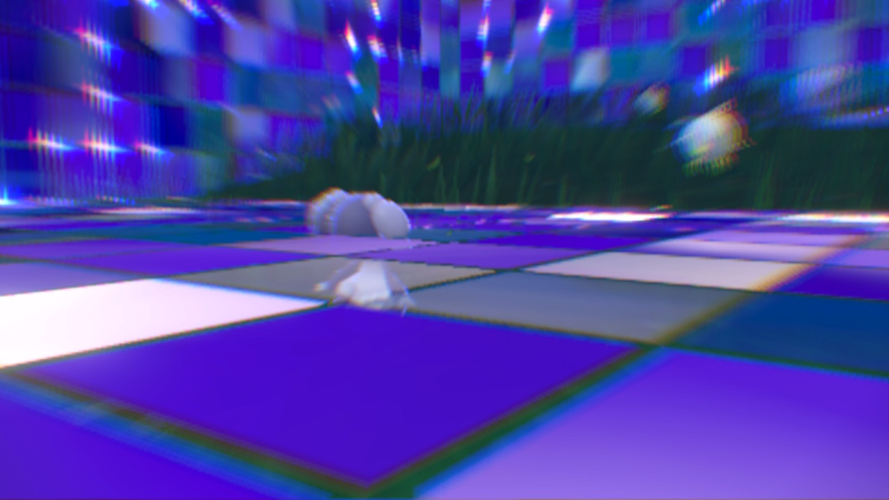

<!--
 * @Author: Ryuk
 * @Date: 2026-08-16 10:30:00
 * @LastEditors: Ryuk
 * @LastEditTime: 2026-08-16 10:30:00
 * @Description: TrickRoom Chinese README
-->

# TrickRoom

<p align="center">
  
</p>

TrickRoom 是一个实时语音聊天室。其语音处理管线由 `src/audio_engine` 驱动 ——
一组封装为统一 C 接口的语音增强算法库。

> **说明：** 部分功能仍在开发中，公开接口可能会调整。欢迎提交 PR 与贡献！

> [English Documentation](README.md)

## 音频引擎简介

`src/audio_engine` 将音频处理算法封装为独立的 C 库，
命名为 `libAE_xxx`（`.a` / `.so` / `.dll`），其中 `xxx` 为算法的大写缩写。
所有库遵循同一设计模式：不透明句柄 + 初始化配置 + 按帧 `Process` 处理 + 统一错误码，
因此整条处理链（如 AEC → NS → AGC2 → SRC）可以直接用纯 C 串联。

### 已封装的库

| 库名         | 算法                     | 说明                                       |
|--------------|--------------------------|--------------------------------------------|
| `libAE_VAD`  | 语音活动检测 (VAD)       | 独立 VAD，语音概率 + 阈值判定              |
| `libAE_SRC`  | 采样率转换               | 基于 sinc 的重采样器（push / pull）        |
| `libAE_NS`   | 降噪 (NS)                | 降噪器（保留语音）                         |
| `libAE_AGC`  | 自动增益控制 (AGC 旧版)  | 模拟 / 数字 AGC                            |
| `libAE_AGC2` | 自动增益控制 2 (AGC2)    | 带 RNN-VAD 的自适应数字增益控制器          |
| `libAE_AECM` | 回声消除 (AECM 移动版)   | 低资源占用回声消除器                       |
| `libAE_AEC`  | 回声消除 (AEC3)          | 全频带回声消除器（AVX2 优化）              |
| `libAE_BF`   | 波束成形 (BF)            | 非线性波束成形器                           |
| `libAE_HS`   | 啸叫抑制 (HS)            | Goertzel 音调检测 + 陷波滤波器             |
| `libAE_IE`   | 可懂度增强 (IE)          | 频谱可懂度改善                             |
| `libAE_TS`   | 瞬态抑制 (TS)            | 键盘敲击 / 瞬态噪声抑制（WPD 树）          |
| `libAE_DR`   | 去混响 (DR)              | Doire 2017 EKF 去混响，仅支持 16 kHz       |

## 目录结构

```
TrickRoom/
├── README.md                       # 英文文档
├── README_zh.md                    # 中文文档（本文件）
├── LICENSE                         # Apache License 2.0
├── assets/                         # 图标等静态资源
├── bin/                            # 预编译程序及配置文件
└── src/
    ├── *.cpp / *.h                 # 聊天室应用（客户端/服务端）
    └── audio_engine/               # 统一音频算法库（libAE_xxx）
        ├── interface/              # 对外 C 接口及公共定义
        ├── audio_processing/       # 算法核心实现
        ├── signal_processing/      # 公共 DSP 代码（窗函数、滤波器、FFT 封装等）
        ├── utils/                  # 非 DSP 公共代码（WAV 读写、环形缓冲等）
        ├── unitest/
        │   ├── test_ae_*.cc        # 接口测试（链接 libAE_xxx）
        │   └── internal/test_*.cc  # 直接调用算法类的内部参考测试
        ├── data/                   # WAV 测试数据与期望输出
        ├── model_weights/          # 神经网络权重（如 RNN-VAD）
        ├── third_party/            # git submodule 形式的第三方依赖
        ├── toolchains/             # CMake 交叉编译工具链（Windows / ARM Linux）
        └── CMakeLists.txt          # 编译所有 libAE_xxx 库与测试
```

## 编译音频引擎

### 前置条件

- CMake ≥ 3.10，支持 C++20 的编译器
- 初始化 git submodule：`git submodule update --init`
- **abseil-cpp** 需编译并安装到 `src/audio_engine/third_party/abseil-cpp/install`
  （构建时通过 `CMAKE_PREFIX_PATH` 的 `find_package(absl)` 定位）
- **Eigen** 以 submodule 形式提供（`third_party/eigen`，锁定 5.0.0 tag），
  仅 `libAE_DR` 依赖；如需使用其他副本，用 `-DEIGEN3_ROOT=<路径>` 指定
- NE10（`neon-fft`）与 pffft submodule 供 FFT 类模块使用
  （`libAE_VAD`、`libAE_NS`、`libAE_AEC`、`libAE_AECM`、`libAE_BF`、`libAE_IE`、`libAE_TS`）

### 配置与编译

Windows（MinGW）：

```bash
cmake -S src/audio_engine -B build -G "MinGW Makefiles" \
      -DCMAKE_TOOLCHAIN_FILE=src/audio_engine/toolchains/x86_64-windows.cmake
cmake --build build -j
```

交叉编译嵌入式 Linux（aarch64 / armv7-NEON）：

```bash
cmake -S src/audio_engine -B build-arm64 \
      -DCMAKE_TOOLCHAIN_FILE=src/audio_engine/toolchains/aarch64-linux-gnu.toolchain.cmake
cmake --build build-arm64 -j
```

默认全部库开启，可用 `-DBUILD_AE_<XXX>=OFF` 单独关闭（如 `-DBUILD_AE_DR=OFF`）。
可用选项：`BUILD_AE_VAD`、`BUILD_AE_SRC`、`BUILD_AE_NS`、`BUILD_AE_AGC`、`BUILD_AE_AGC2`、
`BUILD_AE_AECM`、`BUILD_AE_AEC`、`BUILD_AE_BF`、`BUILD_AE_HS`、`BUILD_AE_IE`、
`BUILD_AE_TS`、`BUILD_AE_DR`。

产物：

- 库文件：`src/audio_engine/lib/libAE_*.a`
- 测试程序：`src/audio_engine/bin/test_ae_*.exe`

## 统一 C 接口

所有库遵循同一模式（公共错误码见 `src/audio_engine/interface/audio_engine_def.h`，
参考范例见 `audio_engine_vad.h`）：

```c
typedef void* VadHandle;

typedef struct {
    int sample_rate;   /* 如 16000                       */
    int frame_len;     /* 每帧样本数，10ms 帧长约束      */
} VadInitConfig;

typedef struct {
    float threshold;   /* 语音概率阈值，(0.0, 1.0] */
} VadRtConfig;

VadHandle AudioEngine_Vad_Create(void);
int AudioEngine_Vad_Init(VadHandle h, const VadInitConfig* cfg);
int AudioEngine_Vad_SetParam(VadHandle h, const VadRtConfig* cfg);    /* 增量：只覆盖传入字段 */
int AudioEngine_Vad_ResetParam(VadHandle h, const VadRtConfig* cfg);  /* 全量：先回默认再应用 */
int AudioEngine_Vad_Process(VadHandle h, const short* audio_in, int samples, int* vad_flag);
int AudioEngine_Vad_Deinit(VadHandle h);
int AudioEngine_Vad_Reset(VadHandle h);   /* 重建内部状态，保留配置 */
int AudioEngine_Vad_Destroy(VadHandle h);
```

各模块统一约定：

- 每实例一个不透明句柄；生命周期为 `Create` / `Init` / `Process` / `Deinit` /
  `Destroy`，另有 `Reset`（重建内部状态、保留配置）。
- 带可调参数的算法提供运行时配置：`SetParam` 增量更新，`ResetParam` 先恢复出厂
  默认再应用新值。
- 统一错误码：`AUDIO_ENGINE_SUCCESS`、`ERR_INVALID_HANDLE`、`ERR_NULL_POINTER`、
  `ERR_NOT_INITIALIZED`、`ERR_INVALID_PARAM`、`ERR_INIT_FAILED`、`ERR_PROCESS_FAILED`。
- 16-bit PCM 输入 / 16-bit PCM 输出；帧长按算法而定
  （如 VAD/NS/AEC 为 10ms 帧，DR 为 16 kHz 下 64 样本）。
- 每个 API 预埋 debug/warn/error 日志。
- FFT 类模块使用 NE10 NEON FFT，利于 ARM 平台性能。
  `libAE_DR` 是经过评审的例外：其 EKF 要求双精度 FFT（Eigen），
  详见 `audio_processing/dereverberation/real_fft.h`。

## 测试

`src/audio_engine/unitest` 下分两层：

- `internal/test_*.cc` —— 直接调用算法类的内部参考测试（行为基准）。
- `test_ae_*.cc` —— 链接 `libAE_xxx` 的接口测试，覆盖正常流程、`Reset` 与错误用例。

在 `src/audio_engine` 目录下运行接口测试（测试数据从 `data/` 读取）：

```bash
./bin/test_ae_vad.exe
```

一致性要求：接口输出必须与对应内部测试的参考输出**逐字节一致**
（见 `data/*_out.wav`）。

## 跨平台

音频引擎面向 Windows、桌面 Linux 与嵌入式 Linux：

- 对外接口不含平台相关代码。
- `src/audio_engine/toolchains/` 提供 `x86_64-windows`（MinGW）、
  `aarch64-linux-gnu`、`arm-linux-gnueabihf`（NEON）工具链文件。
- AVX2 指令在 x86-64 平台以独立按文件实现的方式使用
  （如 `sinc_resampler_avx2.cc`、AEC3 向量运算）。

## 许可证

TrickRoom 本体以 [Apache License 2.0](LICENSE) 发布。

本项目依赖第三方组件，其许可证同样适用于仓库中对应的部分。在分发或嵌入前，
请逐一审阅各依赖的许可证：

| 组件                                              | 许可证                                                            |
|---------------------------------------------------|-------------------------------------------------------------------|
| 本仓库（TrickRoom）                                | Apache License 2.0                                                |
| abseil-cpp                                        | Apache License 2.0                                                |
| NE10 / neon-fft                                   | Apache License 2.0                                                |
| WebRTC（`audio_processing`、`signal_processing`）  | BSD 3-Clause；少量例程为公共领域（见 `src/audio_engine/signal_processing/LICENSE`） |
| pffft                                             | BSD 类宽松许可证                                                  |
| Eigen                                             | MPL 2.0（少量文件为 BSD 或其他与 MPL2 兼容的条款）                |
| Voicebox v_spendred（libAE_DR 参考实现）           | 参见上游 [Voicebox](https://github.com/ImperialCollegeLondon/sap-voicebox) 项目 |
| 应用层依赖（如 `third_party/` 中的 OpenAL）        | 参见其各自的许可证                                                |

> 以上信息仅为方便说明，不构成法律建议。

## 参考资料

1. <https://github.com/akw0088/zoomy> —— TrickRoom 所基于的聊天室代码库
2. <https://webrtc.googlesource.com/src/> —— WebRTC，多数封装算法的来源
3. <https://github.com/ImperialCollegeLondon/sap-voicebox> —— MATLAB Voicebox 工具箱
   （v_spendred），libAE_DR 的参考实现
4. C. S. J. Doire et al., "Single-channel online enhancement of speech corrupted by
   reverberation and noise", IEEE Trans. ASLP 25(3), 2017（libAE_DR）
